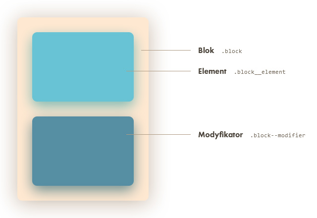
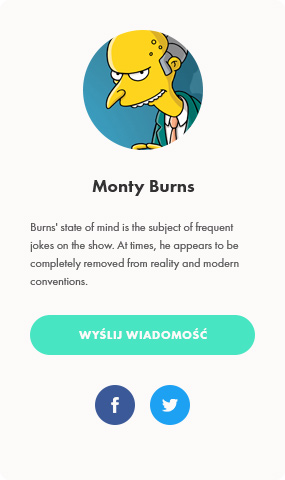

# BEM

Mimo dużej popularności BEMa, bardzo ciężko znaleźć w Internecie przykłady i opisy bardziej rozbudowane, niż podstawowy 
nagłówek + wyszukiwarka. W tym dokumencie przedstawię podstawy działania tego systemu, jego korzyści, wady, 
a także mniej i bardziej rozbudowane przykłady użycia.

***

## Ideologia systemu BEM

**B**lok, **E**lement, **M**odyfikator to metodologia stworzona głównie po to, by walczyć ze specyficznością reguł
 w CSS. Specyficzność (ang. specificity) określa ilość zagnieżdzeń, a przez to poziom skomplikowania wynikowego
 kodu. 
 
 Duży wzrost specyficzności przypisywany jest pojawieniu się preprocesorów takich jak LESS czy S(C|A)SS. Tworzenie 
 tam kolejnych zagnieżdżeń jest bardzo proste, przez co bardzo szybko kod zaczyna być niepotrzebnie skomplikowany
 i trudny w użyciu.

## Bloki, elementy, modyfikatory
 
 BEM rozdziela wszystkie elementy wyglądu na trzy kategorie - bloki, ich elementy i modyfikatory. 
  
 - **Blok** to coś na kształt rodzica danego komponentu. Może się zdarzyć, że nie będzie miał dzieci - będzie to przycisk
 lub coś podobnego.
 - **Element** to dziecko komponentu. Należy pamiętać, że element nie może już mieć dzieci - nawet jeżeli wizualnie 
 znajduje się w środku.
 - **Modyfikator** to dodatkowy wariant danego bloku czy elementu. Może różnić się od podstawy w dość nieznaczny sposób.
 Jeżeli zmian jest dużo, warto rozważyć stworzenie nowego elementu lub nawet bloku.


Tu przedstawiam prosty schemat wyglądu:


 

## Zalety i wady BEMa
 
 BEM, tak samo jak każda inna metodologia, ma swoje zalety, ale też wady. W Internecie często można natknąć się
 na dużą listę tych pierwszych, a mało kiedy na *jakąkolwiek* listę drugich. 
 
 Zacznijmy jednak od tych dobrych stron:
 
 - **modułowość** - tworząc komponenty w BEMie mamy możliwość używania ich w kilku miejscach jednocześnie, nie
 martwiąc się przy tym, czy umieszczenie go wewnątrz innego elementu nie zmienimy niechcący wyglądu. Ponadto, wszystkie
 elementy danego komponentu są de-facto oddzielnym bytem możliwym do wykorzystania osobno. To bardzo ułatwia późniejszą
 pracę, kiedy graficy korzystają z gotowych elementów.
 - **niska specyficzność** - rzecz idealna jeżeli chodzi o renderowanie wyglądu przez przeglądarkę. Im więcej 
 zagnieżdżeń, tym przeglądarka musi wykonać więcej pracy. Jeżeli nie musi wchodzić głęboko, pracuje szybciej.
 - **zachowanie zmian** - zmiejąc `.class-one` wiesz, że modyfikujesz tylko ten element. Nie będzie niespodzianek
 polegających na tym, że w innym pliku ktoś również stylował tę klasę.
 - **wymuszenie dobrych praktyk** - BEM jako metodologia jest dość restrykcyjna, przez co wymusza na programiście
 trzymanie się ustalonych wcześniej reguł (zachowanie katalogów, nazewnictwo itd).
  
 To podstawowe zalety korzystania z tej metodologii. Jakie są wady?
 
 - **nieładny HTML** - to największa wada - nagle elementy mają długie, złożone nazwy. 
 - **narzut pracy** - na początku faktycznie może się wydawać, że BEM wymaga większego nakladu pracy, ale 
 rezultat zdecydowanie wynagradza tę niedogodność.
 - **zerwanie z nawykami** - tak naprawdę, to jest największa wada BEMa w oczach programistów, którzy zaczynają
 z tym standardem. Wymaga porzucenia myślenia na zasadzie `.parent > .children ( > .grandchildren )`, a wymusza
 `.element {} .element__children {}, element__grandchildren {}` lub nawet `.element {} .children {} .grandchildren {}`.
 
## Prosty przykład - karta użytkownika

Przygotowałem niewielką grafikę przedstawiająca popularną kartę użytkownika, zawierającą awatar, nazwę, kilka zdań, 
przycisk i ikonki socjalne. Uznałem, że każdy element jest zależny od klasy `.user-card`. Wygląda tak:



Na pierwszy rzut oka możemy wyróżnić:

- awatar;
- nazwę użytkownika;
- opis;
- przycisk do wysyłania wiadomości;
- przycisk do facebooka;
- przycisk do twittera.

Jak wcześniej napisałem, założymy że wszystkie te elementy pierwszy raz pojawiają się na tej karcie. Nasz kod
HTML będzie następujący:

```html
<figure class="user-card">
    
    <figcaption>
        <h3 class="user-card__name">Monty Burns</h3>
        <p class="user-card__description">Burns' state of mind is the subject of frequent jokes on the show. 
        At times, he appears to be completely removed from reality and modern conventions.</p>
        <a href="#" class="user-card__button">Wyślij wiadomość</a>
        <ul class="user-card__social-wrapper">
            <li class="user-card__social-item">
                <a href="http://facebook.com/montyburns" class="user-card__social-icon user-card__social-icon--facebook">Facebook</a>
            </li>
            <li class="user-card__social-item">
                <a href="http://twitter.com/montyburns" class="user-card__social-icon user-card__social-icon--twitter">Twitter</a>
            </li>
        </ul>
    </figcaption>
</figure>
```

Nie będę tu pisał stylowania całości, podam za to zapis dla LESS i SCSS:

```scss
.user-card {
    ...
    
    &__name {
        ...
    }
    
    &__description {
        ...
    }
    
    &__button {
        ...
    }
    
    &__social-wrapper {
        ...
    }
    
    &__social-item {
        ...
    }
    
    &__social-icon {
        ...
        
        &--facebook {
            ...
        }
        
        &--twitter {
            ...
        }
    }
}
```

Jak widzicie, kod ma dwa zagnieżdżenia - jedno dla elementów i drugie dla modyfikatorów. Najważniejsze to to, 
żeby nie tworzyć elementu w elemencie, co wydaje się być dość oczywiste przy okazji elementu `.user-card__social-wrapper`
i jego dzieci.

Wszystkie powstałe tutaj elementy można teraz wykorzystywać w każdym miejscu w naszym projekcie. Jednak - przynajmniej 
dla mnie, jest coś nieprzyjemnego w korzystaniu z klasy `user-card__name` w opisie produktu czy czegoś podobnego. 
Na szczęście możemy to łatwo obejść.

## Trudny przykład - karta użytkownika współdzieląca elementy

Weźmy teraz nasz przykład i dostosujmy go do bardziej realnych standardów. Przycisk służący do kontaktu, nazwa i tekst,
przyciski socialowe - te wszystkie elementy przeniesiemy do komponentów globalnych - takich, które mogą być użyte
tutaj i w setkach innych miejsc.

```html
<figure class="user-card">
    
    <figcaption>
        <h3 class="box__name">Monty Burns</h3>
        <p class="article__text article__text--small">Burns' state of mind is the subject of frequent jokes on the show. 
        At times, he appears to be completely removed from reality and modern conventions.</p>
        <a href="#" class="button button--blue">Wyślij wiadomość</a>
        <ul class="social-icons">
            <li class="social-icons__item">
                <a href="http://facebook.com/montyburns" class="social-icons__icon social-icons__icon--facebook">Facebook</a>
            </li>
            <li class="social-icons__item">
                <a href="http://twitter.com/montyburns" class="social-icons__icon social-icons__icon--twitter">Twitter</a>
            </li>
        </ul>
    </figcaption>
</figure>
```

W tej chwili CSS wygląda tak:

#### _social-icons.scss
```scss
.social-icons {
    ...
    
    &__item {
        ...
    }
    
    &__icon {
        ...
        
        &--facebook {
            ...
        }
        
        &--twitter {
            ...
        }
    }
}
```

#### _box.scss
```scss
.box {
    ...
    
    &__title {
        ...
    }
}
```

#### _article.scss 
```scss
.article {
    ...
    
    &__text {
        ...
        
        &--small {
            ...
        }
        
    }
}
```

#### _user.scss
```scss
.user {
    ...
    
    &__card {
        ...
    }
}
```

Dzięki tej zmianie współdzielimy style z innymi elementami, które wyglądają tak samo. Mamy przez to kilka małych 
klas-komponentów, które mogą być użyte gdziekolwiek indziej na stronie.

## Modyfikatory i metoda `$at-root`

Korzystanie z modyfikatorów wydaje się mieć jedną podstawową wadę. Gdy chcemy zmienić jakiś blok, każdy element
także musi otrzymać dodatkową klasę. To jest jedno z działających i całkowicie poprawnych rozwiązań, jednak jest inne,
lepsze.

Używanie zmiennej `$at-root` pozwala na zrobienie zagnieżdżeń w stylu akceptowalnym przez BEM. Używać jej należy
jednak tylko do obsługi modyfikatorów, nigdy do dziedziczenia elementów.

Metoda wygląda nastepująco:

```scss
.block {
    $at-root: &; // zdefiniowanie zmiennej jako & czyli obecny element (w tym przypadku - .block)
    ...
    
    &__title {
        font-size: 1em;
    }
    
    /* ==== modificators */
    
    &--large { // modyfikator
        #{$at-root}__title { // używamy zmiennej $at-root, przez co uzyskujemy selektor .block__title 
            font-size: 15em;
        }
    }
}
```
Użycie takiej nazwy zmiennej na początku może powodować niejasności, dlatego warto zmienić nazwę tej zmiennej na 
camelCase odpowiadający klasie. W powyższym przykładzie będzie to `$block`, w przypadku klasy `.user-block` - 
`$userBlock'.` Ten sam przykład będzie teraz wyglądał tak:

```scss
.block {
    $block: &;
    ...
    
    &__title {
        font-size: 1em;
    }
    
    /* ==== modificators */
    
    &--large { // modyfikator
        #{$block}__title { // używamy zmiennej $at-root, przez co uzyskujemy selektor .block__title 
            font-size: 15em;
        }
    }
}
```

## BEM i media queries

Korzystanie z media queries podczas pisania CSSa jest praktycznie nieuniknione. Jedynie w niewielkich komponentach, które 
zawsze wyglądają tak samo można je pominąć. W znacznej większości jednak będą one obecne. Przy pracy z nimi warto 
pamiętać o schemacie używania ich na zasadzie blokowej - wpisywania całego bloku odpowiedzialnego za dany
przedział na samym dole komponentu. Oto, o czym mówię (numery w nawiasach pokazują, gdzie nadpisywanie są dane 
właściwości):

```scss
.block {
    font-size: 1.5em; // (1)
    ...
    
    &__title {
        color: #ff0000; // (2)
    }
    
    &__text {
        font-size: 2em; // (3)
    }
    
    /* === media queries */
    
    @media (min-width: 768px) {
        font-size: 1.25em; // (1)
        
        &__title {
            color: #ffff00; // (2)
        }
    }
    
    @media (min-width: 1024px) {
        &__text {
            font-size: 1.5em; // (3)
        }
    }
}
```

Jak widać, notacja ta pomaga skupić się na konkretnej rozdzielczości, a pracując z metodologią *mobile-first* jest
to niesamowicie przydatne.

***

Korzystanie z BEMa jest w zasadzie bardzo proste. Jedyne, czego trzeba pilnować to pamiętanie
o tym, by elementy tworzyć tylko wewnątrz bloków.

***

Autor: [Tomek Buszewski](mailto:tomasz.buszewski@rp.pl)